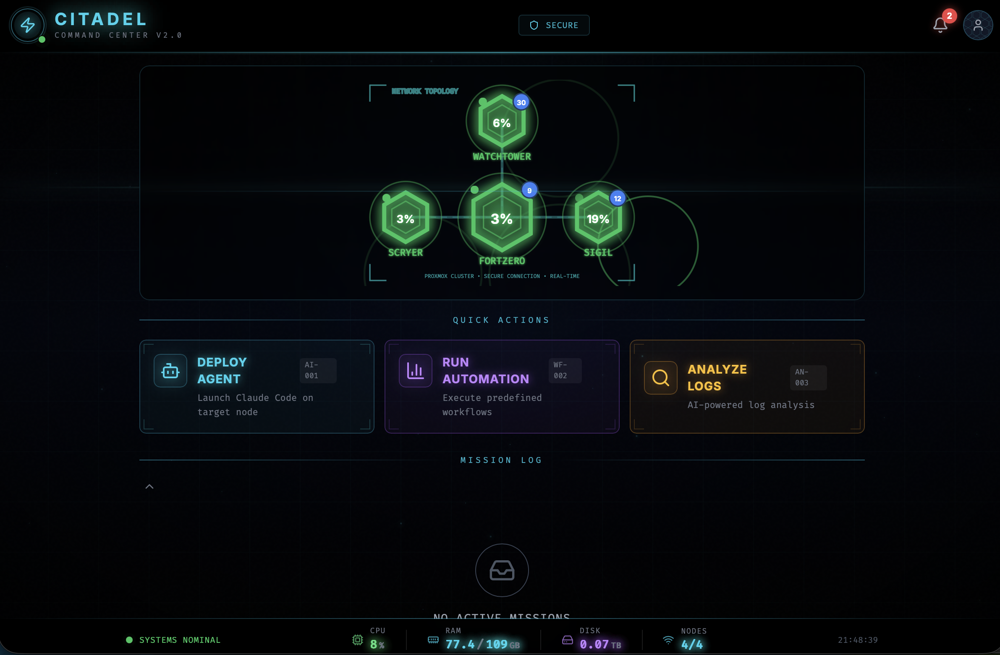
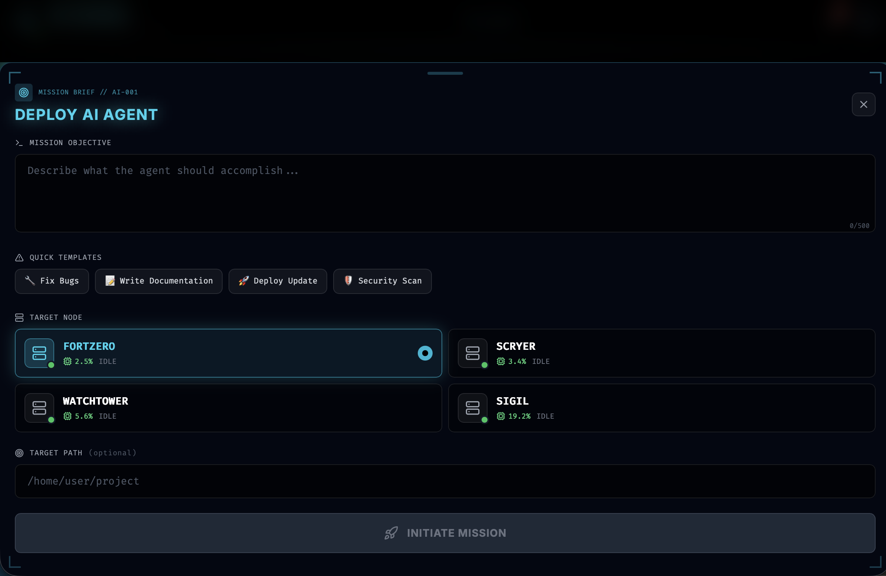
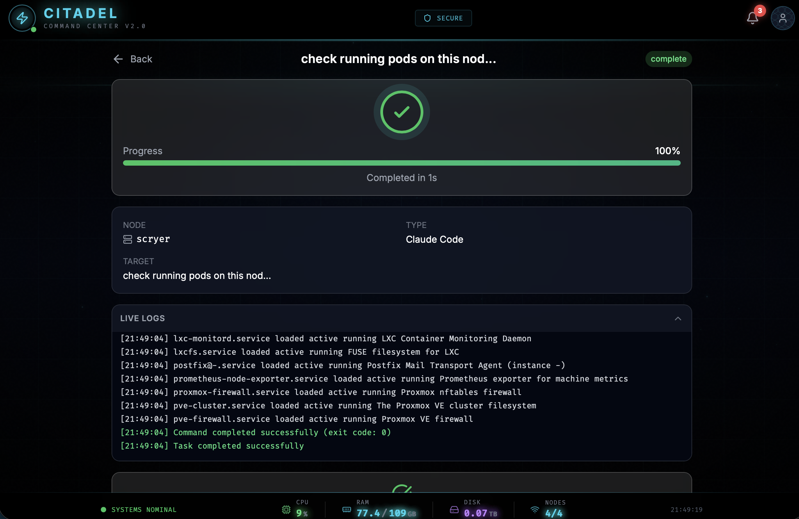
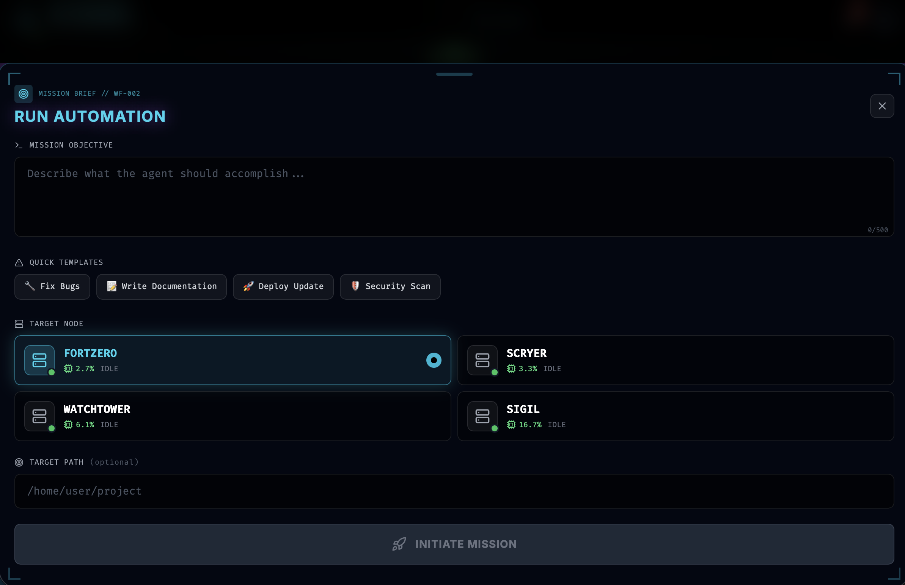

# Citadel Command Center

A mobile-first Progressive Web App for managing homelab infrastructure with a sci-fi command center aesthetic. Execute SSH commands, monitor cluster resources, and manage tasks across Proxmox nodes and K3s clusters.

## Features

- **Real-time Network Topology** - Interactive SVG visualization of Proxmox nodes with live CPU/status indicators
- **Live Cluster Metrics** - Aggregated CPU, RAM, and disk usage from Proxmox API
- **K3s Integration** - Pod counts and node status from Kubernetes cluster
- **Task Execution** - SSH-based command execution on remote nodes with live log streaming
- **Template System** - Quick-start templates for common operations
- **PWA Support** - Install as native app on mobile devices

## Tech Stack

### Frontend
- **Vite** + **React 18** + **TypeScript** (strict mode)
- **Tailwind CSS** - Custom dark theme with neon accents
- **Framer Motion** - Smooth animations and transitions
- **Zustand** - Lightweight state management
- **Lucide React** - Icon library

### Backend
- **FastAPI** - Modern Python web framework
- **asyncssh** - Async SSH client for remote execution
- **httpx** - Async HTTP client for Proxmox API
- **kubernetes** - Official K8s Python client

## Architecture

```
citadel-command/
├── frontend/                # React PWA
│   ├── src/
│   │   ├── components/      # UI components
│   │   │   ├── Header.tsx
│   │   │   ├── NetworkGraph.tsx
│   │   │   ├── QuickActions.tsx
│   │   │   ├── ActiveOperations.tsx
│   │   │   ├── TaskModal.tsx
│   │   │   ├── TaskDetail.tsx
│   │   │   └── MetricsTicker.tsx
│   │   ├── hooks/           # Custom React hooks
│   │   │   ├── useNodes.ts
│   │   │   ├── useMetrics.ts
│   │   │   └── useHealth.ts
│   │   ├── store/           # Zustand state
│   │   ├── styles/          # Animation variants
│   │   └── types/           # TypeScript definitions
│   └── public/              # PWA assets
│
├── backend/                 # FastAPI server
│   ├── app/
│   │   ├── main.py          # FastAPI app
│   │   ├── config.py        # Settings & node mappings
│   │   ├── models.py        # Pydantic models
│   │   ├── routers/
│   │   │   ├── health.py    # /health endpoint
│   │   │   ├── nodes.py     # /nodes, /nodes/metrics
│   │   │   └── tasks.py     # /tasks CRUD + execution
│   │   └── services/
│   │       ├── proxmox.py   # Proxmox API client
│   │       ├── k3s.py       # Kubernetes client
│   │       └── ssh.py       # SSH executor
│   └── .env                 # Credentials (not in git)
└── README.md
```

## API Endpoints

| Endpoint | Method | Description |
|----------|--------|-------------|
| `/health` | GET | System health check (Proxmox + K3s) |
| `/nodes` | GET | List all nodes with metrics |
| `/nodes/metrics` | GET | Aggregated cluster metrics |
| `/nodes/k3s` | GET | K3s node details |
| `/tasks` | GET | List all tasks |
| `/tasks` | POST | Create and execute new task |
| `/tasks/{id}` | GET | Get task status and logs |
| `/tasks/{id}/logs` | GET | Poll for new logs (incremental) |

## Setup

### Prerequisites
- Node.js 18+
- Python 3.10+
- SSH key configured for target nodes
- Proxmox API token
- K3s kubeconfig

### Frontend

```bash
cd frontend
npm install
npm run dev
```

Frontend runs at `http://localhost:5173`

### Backend

```bash
cd backend
python3 -m venv venv
source venv/bin/activate
pip install -r requirements.txt

# Configure credentials
cp .env.example .env
# Edit .env with your settings

# Start server
uvicorn app.main:app --reload --host 0.0.0.0 --port 8000
```

Backend runs at `http://localhost:8000`

## Configuration

### Backend `.env`

```bash
# Proxmox
PROXMOX_HOST=10.0.0.10
PROXMOX_PORT=8006
PROXMOX_TOKEN_ID=monitoring@pve!monitoring
PROXMOX_TOKEN_SECRET=your-token-secret
PROXMOX_VERIFY_SSL=false

# K3s
K3S_API_SERVER=https://10.0.1.10:6443
K3S_KUBECONFIG_PATH=~/.kube/config

# SSH
SSH_USER=root
SSH_KEY_PATH=~/.ssh/id_ed25519

# Server
API_HOST=0.0.0.0
API_PORT=8000
CORS_ORIGINS=http://localhost:5173
```

### Node SSH Configuration

The backend automatically uses the correct SSH user per node:
- **Proxmox hosts** (proxmox-0, proxmox-1, proxmox-2, proxmox-3): `root`
- **K3s nodes** (k3s-cp-1, k3s-cp-2, etc.): `admin`

## Task Execution

Tasks are executed via SSH based on prompt keywords:

| Keyword | Action |
|---------|--------|
| `services`, `check` | Docker containers, K8s pods, systemd services |
| `resources`, `memory`, `cpu` | System resource usage |
| `docker` | List Docker containers |
| `pods`, `kubernetes` | List K8s pods |
| `disk`, `storage` | Disk usage |
| `logs` | Recent system logs |
| `network` | Network info |

## Screenshots

### Dashboard
The main dashboard features a tactical network topology with hexagonal nodes showing real-time CPU usage, animated data flow particles, and quick action cards.



### Deploy AI Agent Modal
Mission briefing style modal for deploying Claude Code agents to target nodes with template quick-starts and real-time CPU monitoring.



### Task Execution Detail
Live task monitoring with progress tracking, SSH log streaming, and completion status in a command center aesthetic.



### Automation Modal
Run predefined automation workflows across your infrastructure with the same mission briefing interface.



### UI Features
- Hexagonal node visualization with status-based glow effects
- Animated particles along connection lines when tasks run
- HUD-style corner brackets and scan line effects
- Bottom sheet modal for task creation
- Live log streaming with terminal styling
- Spring-animated metrics in the status bar

## Development

```bash
# Frontend (with hot reload)
cd frontend && npm run dev

# Backend (with auto-reload)
cd backend && uvicorn app.main:app --reload

# Type checking
cd frontend && npm run lint
```

## Roadmap

- [x] Phase 1: Frontend UI with mock data
- [x] Phase 2: Proxmox + K3s API integration
- [x] Phase 3: SSH task execution with live logs
- [ ] Phase 4: WebSocket for real-time updates
- [ ] Phase 5: Claude Code AI agent integration
- [ ] Phase 6: Mobile deployment

## License

MIT
